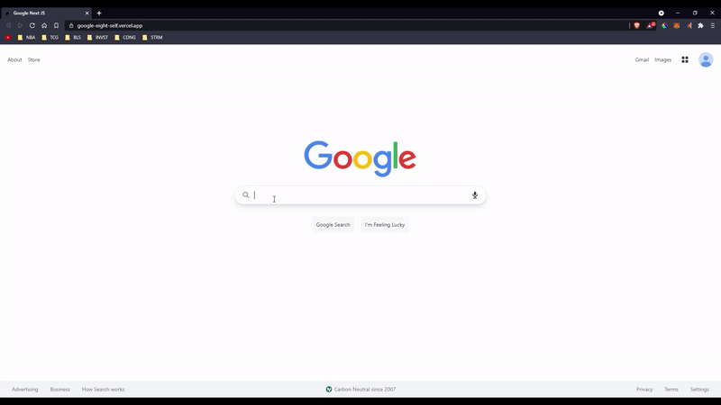

# Google Clone

This Google inspired website is a search engine app. It was build with Next JS Framework, utilizes the Google Search API, and the design has been made mobile responsive through the use of Tailwind CSS.

## Features

- Reengineered a fully responsive search app using the Next JS framework for a dynamic production build
- Deployed app through Vercel for enhanced scalability and integrated page pagination to sort through thousands
  of search results via Google API for a seamless UX
- Utilized the maintainability of Tailwind CSS for an adaptable and mobile first design

## Author

Jason Rillera: https://github.com/JasonRillera

## [Live Demo](https://google-eight-self.vercel.app/)

